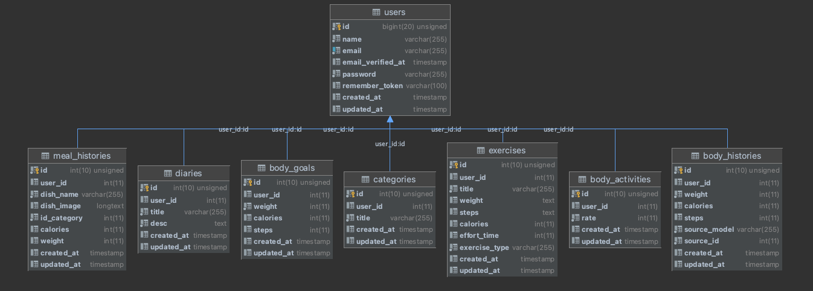

## Cài đặt (áp dụng với MAC/UNIX/LINUX)
> Với máy window, view Makefile để theo hướng dẫn chạy bằng tay hoặc liên hệ mình :D

##### Yêu cầu trước khi cài đặt
```
Docker
Makefile (GCC, C++)
```

S1: Chạy lần đầu tiên
```shell
$ make setup
$ make build
```

S2: Cài đặt và restore database (chỉ chạy 1 lần duy nhất)
```shell
$ make up
$ make migrate
```

Sau khi chạy hoàn tất sẽ có các thông tin sau thêm tự động
 ```
Script sẽ tự thêm arent_healthy.test vào /etc/hosts
Restore simple data vào database
 ```

### Command `Bật` / `Tắt` / `Khởi động lại` services
```
$ make up
$ make down 
$ make restart    
```

##### Link Postman API document
> Lưu ý chọn Environment cho post man là **development**
Không thể chạy trực tiếp từ tình duyệt, vui lòng tải về postman local

```
https://www.postman.com/galactic-zodiac-448331/workspace/arenthealthytest
```

# Các API theo các Page từ bài test
Note
```
_date: Sử dụng format YYYY-mm-dd, có thể để empty thì mặc định tính theo ngày hiện tại
host: arent_healthy.test
```
## Top page
### 日付・達成率(Date/Achievement rate)
```azure
GET /api/body/stats/achievement-rate?_date=
Host: arent_healthy.test
Accept: application/json
```
### 体重・体脂肪率グラフ(Weight/Body Fat Percentage Graph)
```azure
GET /api/body/stats/activities?_date=&_group_date=day
Host: arent_healthy.test
Accept: application/json
```
### 食事履歴(Meal history)
```azure
GET /api/body/meal/history HTTP/1.1
Host: arent_healthy.test
Accept: application/json
```

## My record page
### 体重・体脂肪率グラフ(Weight/Body Fat Percentage Graph)
```azure
GET /api/body/stats/activities?_date=&_group_date=(day|month|week|year)
Host: arent_healthy.test
Accept: application/json
```
### 運動記録(Exercise record)
```azure
GET /api/exercises?_date=
Host: arent_healthy.test
Accept: application/json
```
### 日記(Diary list)
```azure
GET /api/diaries?_date=
Host: arent_healthy.test
Accept: application/json
```

## Column page
### Recommended column (name by figma design)
```azure
GET /api/recommends/columns HTTP/1.1
Host: arent_healthy.test
Accept: application/json
```
### Recommended diet (name by figma design)
```azure
GET /api/diets/columns HTTP/1.1
Host: arent_healthy.test
Accept: application/json
```
### Recommended beauty (name by figma design)
```azure
GET /api/beauty/columns HTTP/1.1
Host: arent_healthy.test
Accept: application/json
```
### Recommended health (name by figma design)
```azure
GET /api/health/columns HTTP/1.1
Host: arent_healthy.test
Accept: application/json
```

## Nghiệp vụ chính

#### table body_histories
- Table này sẽ lưu trữ các chỉ số về weight, calories, steps
- Table sẽ được insert/update dữ liệu khi các dữ liệu trên các bảng `meat_histories, exercises` có thay đổi về dữ liệu (trigger)

#### table body_activities
- Table này sẽ lưu trữ chỉ số về tỷ lệ hoàn thành của người dùng
- Table này sẽ trìgger tự động dữ liệu mới cập nhật trên `body_histories` để tính toán chỉ số hoàn thành
- Công thức sẽ dựa vào `body_goals` trong đó là (`weight,calories,steps`) thiết lập từ người dùng 

#### table exercises
- Lưu trữ các bài tập người dùng theo ngày
- Khi dữ liệu được thay đổi/thêm mới, sẽ có listener để update vào `body_histories`

#### table meal_histories
- Lưu trữ các bữa ăn người dùng theo ngày
- Khi dữ liệu được thay đổi/thêm mới, sẽ có listener để update vào `body_histories`

#### table diaries
- Lưu trữ nhật ký theo người dùng

#### table categories
- Lưu trữ danh mục bữa ăn theo người dùng

### TABLE DIAGRAM


